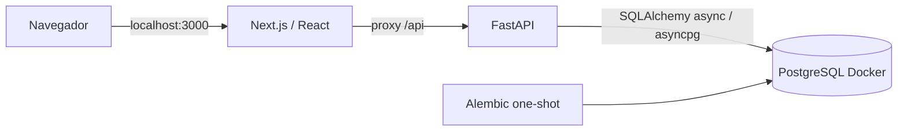

# Arquitectura de la base

Decisiones de implementación, no requisitos adicionales del PDF. Alcance actual: fase 1.

Solo frontend publica un puerto, enlazado a 127.0.0.1. Backend y PostgreSQL permanecen en la red Compose. El navegador consulta rutas del mismo origen; no resuelve nombres Docker. FastAPI conserva negocio y persistencia; Next.js no tiene credenciales ni driver PostgreSQL. Las rewrites se fijan en la build de la imagen con API_INTERNAL_URL=http://backend:8000.

PostgreSQL permite en futuras fases integridad referencial, unicidad, transacciones y bloqueos concurrentes reales. Esta fase reserva el esquema `b2b` mediante Alembic (0001_bootstrap); no crea usuarios, empresas ni tablas de negocio. Readiness consulta PostgreSQL y comprueba el esquema migrado; health solo comprueba el proceso. Conexiones breves con pool_pre_ping, timeout de conexión y statement_timeout. El lifespan cierra el engine. No hay capas/repositorios vacíos ni AsyncSession compartida.

El servicio migrate aplica Alembic antes del backend, que debe estar sano antes del frontend. El volumen database-data persiste entre arranques y reconstrucciones. Los tests usan proyecto, red, base y volumen distintos; solo sus recursos se limpian al finalizar.

## Versiones fijadas

Consultadas el 2026-10-01 en registros oficiales npm/PyPI y Docker Hub. No se afirma que todas sean las últimas: la selección prima compatibilidad comprobada. Imágenes con tag concreto y digest multiarquitectura, acciones con SHA; lockfiles fijan transitivas y hashes.

| Capa | Versiones |
|---|---|
| Runtime backend | Python 3.12.15, uv 0.12.7 |
| API / configuración | FastAPI 0.142.2, Uvicorn 0.54.0, pydantic-settings 2.15.0 |
| Persistencia | SQLAlchemy[asyncio] 2.1.1, asyncpg 0.31.0, Alembic 1.20.0 |
| Base | PostgreSQL 17.11 (bookworm) |
| Runtime frontend | Node 22.23.3, npm 11.21.0 |
| UI | Next.js 16.3.8, React / ReactDOM 19.3.0, TypeScript 6.0.3, TailwindCSS 4.3.3 |
| Calidad Python | Ruff 0.16.10, mypy 2.4.0, pytest 9.1.1, pytest-asyncio 1.4.0, pytest-cov 7.1.0, HTTPX2 2.13.1 |
| Calidad UI | ESLint 10.11.0, typescript-eslint 8.71.0, hooks 7.1.1, @next/eslint-plugin-next 16.3.8, Prettier 3.9.9 |
| Pruebas UI | Vitest / coverage-v8 4.1.11, RTL 16.3.3, jest-dom 6.9.1, MSW 2.15.0, jsdom 30.1.1, Playwright 1.63.0 |
| Seguridad | pip-audit 2.10.1, Gitleaks 8.30.1, npm audit |

SQLAlchemy 2.1 exige el extra asyncio/greenlet; HTTPX2 evita la API obsoleta de Starlette TestClient. La configuración completa eslint-config-next arrastraba plugins incompatibles con ESLint 10: se utilizan las reglas oficiales Next y React Hooks junto a typescript-eslint compatible con ESLint 10. Vitest 4/jest-dom 6/MSW 2 forman la combinación comprobada; no se fuerzan peer dependencies. TypeScript 6 incluye tipos web necesarios para Next y es compatible con typescript-eslint (<6.1). jsdom exige Node >=22.22.2; el Node 22.14.0 preinstalado no sirve para esta suite. Los contenedores suministran el runtime adecuado.

Referencias oficiales: [Next instalación y lint](https://nextjs.org/docs/app/getting-started/installation), [SQLAlchemy async 2.1](https://docs.sqlalchemy.org/en/21/orm/extensions/asyncio.html), [ESLint flat config](https://eslint.org/docs/latest/use/configure/configuration-files), [pruebas Next/Vitest](https://nextjs.org/docs/app/guides/testing/vitest), [cobertura Vitest](https://vitest.dev/config/coverage), [soporte PostgreSQL](https://www.postgresql.org/support/versioning/).

## Decisiones reservadas para fases posteriores

Modelo descrito por el plan: companies, users, subscriptions, auth_sessions, license_assignments, usage_periods, api_usage_events y alerts, con aislamiento de empresa e invariantes transaccionales. No existen todavía. Context para sesión/preferencias, TanStack Query para datos remotos y Recharts como única biblioteca de gráficos se incorporarán cuando tengan uso real. JWT/CSRF, seeds de dos empresas y SSE quedan pendientes de autorización de sus fases.

La UI inicial es administrativa, sobria, en español, sin fuentes descargadas durante la build. Presenta únicamente disponibilidad real y alcance, sin métricas ni controles de negocio simulados.
