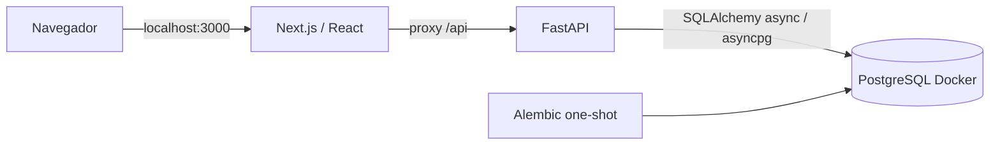

# Arquitectura de la base

Decisiones de implementación, no requisitos adicionales del PDF. Alcance actual: fase 1.

Solo frontend publica un puerto, enlazado a 127.0.0.1. Backend y PostgreSQL permanecen en la red Compose. El navegador consulta rutas del mismo origen; no resuelve nombres Docker. FastAPI conserva negocio y persistencia; Next.js no tiene credenciales ni driver PostgreSQL. Las rewrites se fijan en la build de la imagen con API_INTERNAL_URL=http://backend:8000.

PostgreSQL permite en futuras fases integridad referencial, unicidad, transacciones y bloqueos concurrentes reales. Esta fase reserva el esquema `b2b` mediante Alembic (0001_bootstrap); no crea usuarios, empresas ni tablas de negocio. Readiness consulta PostgreSQL y comprueba el esquema migrado; health solo comprueba el proceso. Conexiones breves con pool_pre_ping, timeout de conexión y statement_timeout. El lifespan cierra el engine. No hay capas/repositorios vacíos ni AsyncSession compartida.

El servicio migrate aplica Alembic antes del backend, que debe estar sano antes del frontend. El volumen database-data persiste entre arranques y reconstrucciones. Los tests usan proyecto, red, base y volumen distintos; solo sus recursos se limpian al finalizar.

## Versiones fijadas

Consultadas el 2026-10-01 en registros oficiales npm/PyPI y Docker Hub. No se afirma que todas sean las últimas: la selección prima compatibilidad comprobada. Imágenes con tag concreto y digest multiarquitectura, acciones con SHA; lockfiles fijan transitivas y hashes.

| Capa | Versiones |
|---|---|
| Runtime backend | Python 3.12.15, uv 0.12.7 |
| API / configuración | FastAPI 0.142.2, Uvicorn 0.54.0, pydantic-settings 2.15.0 |
| Persistencia | SQLAlchemy[asyncio] 2.1.1, asyncpg 0.31.0, Alembic 1.20.0 |
| Base | PostgreSQL 17.11 (bookworm) |
| Runtime frontend | Node 22.23.3, npm 11.21.0 |
| UI | Next.js 16.3.8, React / ReactDOM 19.3.0, TypeScript 6.0.3, TailwindCSS 4.3.3 |
| Calidad Python | Ruff 0.16.10, mypy 2.4.0, pytest 9.1.1, pytest-asyncio 1.4.0, pytest-cov 7.1.0, HTTPX2 2.13.1 |
| Calidad UI | ESLint 10.11.0, typescript-eslint 8.71.0, hooks 7.1.1, @next/eslint-plugin-next 16.3.8, Prettier 3.9.9 |
| Pruebas UI | Vitest / coverage-v8 4.1.11, RTL 16.3.3, jest-dom 6.9.1, MSW 2.15.0, jsdom 30.1.1, Playwright 1.63.0 |
| Seguridad | pip-audit 2.10.1, Gitleaks 8.30.1, npm audit |

SQLAlchemy 2.1 exige el extra asyncio/greenlet; HTTPX2 evita la API obsoleta de Starlette TestClient. La configuración completa eslint-config-next arrastraba plugins incompatibles con ESLint 10: se utilizan las reglas oficiales Next y React Hooks junto a typescript-eslint compatible con ESLint 10. Vitest 4/jest-dom 6/MSW 2 forman la combinación comprobada; no se fuerzan peer dependencies. TypeScript 6 incluye tipos web necesarios para Next y es compatible con typescript-eslint (<6.1). jsdom exige Node >=22.22.2; el Node 22.14.0 preinstalado no sirve para esta suite. Los contenedores suministran el runtime adecuado.

Referencias oficiales: [Next instalación y lint](https://nextjs.org/docs/app/getting-started/installation), [SQLAlchemy async 2.1](https://docs.sqlalchemy.org/en/21/orm/extensions/asyncio.html), [ESLint flat config](https://eslint.org/docs/latest/use/configure/configuration-files), [pruebas Next/Vitest](https://nextjs.org/docs/app/guides/testing/vitest), [cobertura Vitest](https://vitest.dev/config/coverage), [soporte PostgreSQL](https://www.postgresql.org/support/versioning/).

## Decisiones reservadas para fases posteriores

Modelo descrito por el plan: companies, users, subscriptions, auth_sessions, license_assignments, usage_periods, api_usage_events y alerts, con aislamiento de empresa e invariantes transaccionales. No existen todavía. Context para sesión/preferencias, TanStack Query para datos remotos y Recharts como única biblioteca de gráficos se incorporarán cuando tengan uso real. JWT/CSRF, seeds de dos empresas y SSE quedan pendientes de autorización de sus fases.

La UI inicial es administrativa, sobria, en español, sin fuentes descargadas durante la build. Presenta únicamente disponibilidad real y alcance, sin métricas ni controles de negocio simulados.

## Evolución autorizada — fase 2

La autorización del propietario (2026-10-02), conservada en PROMPT_FASE_2_CODEX_SUSCRIPCIONES_B2B.txt, sustituye únicamente el alcance de ejecución anterior. El texto previo conserva las decisiones históricas del bootstrap. No añade requisitos al PDF.

`0002_auth_tenancy` agrega companies, users, subscriptions y auth_sessions en b2b, además de login_bucket como control técnico acotado. Email global único y normalizado, roles Admin/User, estados active/inactive, FKs, cuotas positivas y un índice parcial de suscripción activa por empresa. Las sesiones referencian al usuario; no duplican company_id. Timestamps timezone-aware UTC. Cada solicitud obtiene su propia AsyncSession; Alembic corre una sola vez antes de servir, sin create_all.

Dependencias nuevas fijadas: PyJWT 2.15.1, argon2-cffi 25.1.0 y TanStack React Query 5.104.1; el stack previo permanece. Referencias: [PyJWT](https://pyjwt.readthedocs.io/en/stable/usage.html), [Argon2](https://argon2-cffi.readthedocs.io/en/stable/), [CSRF OWASP](https://cheatsheetseries.owasp.org/cheatsheets/Cross-Site_Request_Forgery_Prevention_Cheat_Sheet.html), [cancelación Query](https://tanstack.com/query/latest/docs/framework/react/guides/query-cancellation).

JWT HS256 fijo, issuer b2b-api, audience b2b-web; sub/jti UUID e iat/exp enteros coherentes y obligatorios. Duración configurable 60–3600 segundos, 1800 por defecto, sin refresh. Cookie b2b_session HttpOnly, SameSite=Strict, Path=/, sin Domain. Producción exige HTTPS/Secure y rechaza seed; secretos independientes de 32 bytes hex aleatorios obligatorios, nunca defaults de demo. Solo development localhost y test permiten HTTP explícito. Cada acceso protegido une sesión vigente/no revocada, usuario y empresa activos, y usa el rol actual en PostgreSQL. require_admin se prueba mediante una ruta exclusiva del test app; no existe ruta administrativa entregada todavía.

CSRF usa un token JWT firmado con clave independiente, nonce aleatorio y binding anonymous antes del login/jti después. b2b_csrf no es HttpOnly; GET /auth/csrf devuelve csrf_token y reutiliza el válido, sin invalidar otras pestañas. POST envía X-CSRF-Token idéntico a la cookie y se valida su firma/expiración/binding. Login rota el token. El cliente pide bootstrap antes de cada mutación; si falla/expira cambia el estado y el usuario puede repetir. Origin debe coincidir exactamente con PUBLIC_ORIGIN; si falta, Referer debe aportar ese origen. null, ambos ausentes y hosts internos no autorizados se rechazan. La allowlist contiene un único origen configurado, sin reflexión ni comodines.

Logout requiere CSRF incluso con JWT vencido. Verifica firma y binding del JWT vencido, revoca la sesión identificada en PostgreSQL y borra cookies con el mismo alcance. Una sesión revocada puede repetir logout; un navegador ya sin cookie puede obtener CSRF anónimo y repetir. JWT inválido/sin cookie solo permite limpiar estado local con CSRF válido, sin otorgar acceso. Un JWT válido que necesite revocación no devuelve éxito si PostgreSQL falla. Otras sesiones de la cuenta permanecen vigentes.

El proxy de Next mantiene Cookie, cada Set-Cookie, headers CSRF/status y Cache-Control: no-store. No implementa autenticación ni accede a PostgreSQL. Uvicorn no confía en proxy headers y no registra URLs/queries de acceso. Logs de error contienen exclusivamente request_id/código/status, sin inputs ni trazas. El sobre global incluye error.code, error.message y request_id, con 401/403/422/429/500/503 reales. Health/readiness conservan sus contratos operativos de fase 1.

El rate limit es global por servicio: 30 intentos por ventana de 60 segundos por defecto. Un upsert atómico mantiene exactamente una fila compartida, expira la ventana y acota el contador a limit+1. Cuenta intentos válidos e inválidos; rechaza con 429 y Retry-After. Cambiar email/case/IP/headers no lo elude. Es consistente entre workers/reinicios, pero una cuenta puede agotar temporalmente el presupuesto común: no se presenta como solución de protección distribuida completa. El stack E2E usa límite activo 120 para su conjunto de navegadores; las pruebas de límite usan valores pequeños y reloj/fechas controlados.

El script local ejecuta generación bajo lock de archivo y reemplazo atómico, conserva valores existentes y guarda .env/.local/demo-credentials.json con 0600. Seed explícito one-shot antes del backend, dos empresas con Admin/User y cuotas 3 licencias/10 API; on-conflict conserva roles, estados, passwords y cuotas. Seed se ejecuta con UID 0 solo para leer el archivo 0600 montado read-only; API/UI siguen sin root. No se montan credenciales en frontend ni en imágenes. Fixtures E2E independientes y protegidas en un directorio temporal eliminado al finalizar; informes públicos no contienen passwords, cookies ni trazas auth.

Context expone únicamente estado derivado de la consulta de sesión en TanStack Query: comprobación, autenticado, anónimo, red y servidor. La recarga usa /me, con comprobación de expiración y foco/intervalo. Cambiar identidad cancela consultas y limpia caché; no se reintentan mutaciones. No hay redirecciones configurables: toda la sesión vive en /, evitando destinos externos. UI mínima con identidad/empresa/rol/logout, labels y foco; sin dashboard administrativo.
